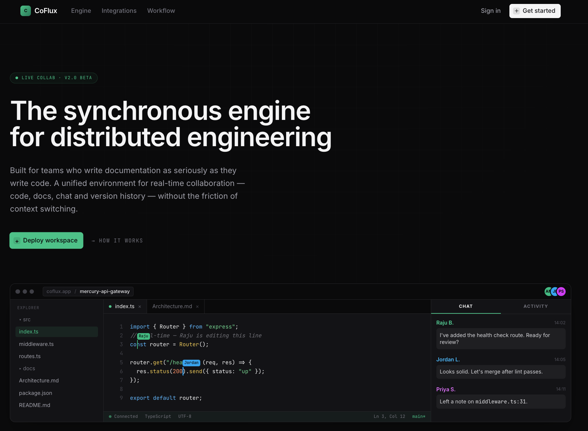
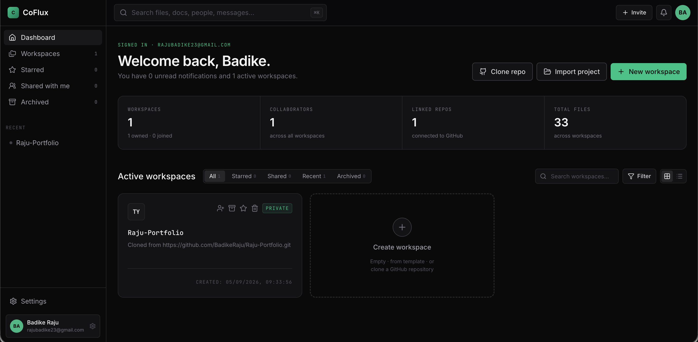
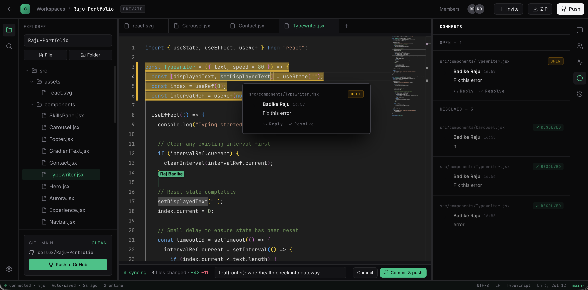

# CoFlux – Real-Time Collaborative Development 

> A real-time collaborative cloud IDE built with Django, React, WebSockets, and Yjs, enabling developers to code together, manage projects, and collaborate seamlessly from anywhere.


---

## Overview

CoFlux is a browser-based collaborative development platform that brings the experience of modern desktop IDEs to the web. It enables multiple developers to edit source code simultaneously, collaborate in real time, manage workspaces, and synchronize projects with GitHub.

The platform is designed for software teams, remote developers, educators, technical interviews, hackathons, and collaborative coding sessions.

---

### Pages Overview

The frontend application features a responsive, route-protected user interface designed around the collaborative development workflow:

### Landing / Welcome Page (`/`)
Introduction to CoFlux, feature highlights, and call-to-action buttons for login and registration.


### User Dashboard (`/dashboard`)
Central hub displaying active workspaces, recent projects, team invitations, and quick-access metrics.


### Collaborative IDE / Editor View (`/workspace/{workspaceId}/project/{projectId}`)
The core workspace screen featuring the Monaco code editor, live file tree, user presence avatars, real-time cursors, and GitHub sync panels.


## Features

### Real-Time Collaborative Editing

- Multi-user code editing
- Live cursor synchronization
- Presence awareness
- Conflict-free editing using Yjs CRDTs
- Automatic document synchronization

---

### Workspace Management

- Create multiple workspaces
- Multiple projects per workspace
- Folder hierarchy
- File explorer
- Persistent storage

---

### Authentication & Authorization

- JWT Authentication
- Login & Registration
- Refresh Tokens
- Role-Based Access Control

Roles

- Owner
- Editor
- Viewer

---

### GitHub Integration

- Clone repositories
- Push commits
- Pull latest changes
- Repository synchronization

---

### Code Editor

- Monaco Editor
- Syntax highlighting
- Auto completion
- Multiple language support
- Themes
- Search & Replace

---

### Team Collaboration

- Live collaboration
- User presence
- Workspace invitations
- Real-time notifications

---

### Dashboard

- Active workspaces
- Recent projects
- Team members
- Repository information

---

### File Management

- Upload files
- Create folders
- Rename
- Delete
- Move
- Download

---

### Backend Features

- REST APIs
- WebSockets
- JWT Authentication
- Role-Based Access Control
- Redis Caching
- Database Persistence

---

## Tech Stack

### Frontend

- React.js
- React Router
- Redux Toolkit
- Tailwind CSS
- Monaco Editor
- Axios
- Yjs
- y-websocket

---

### Backend

- Python
- Django
- Django REST Framework
- Django Channels
- JWT Authentication
- WebSockets

---

### Database

- MySQL

---

### Caching & Messaging

- Redis

---

### DevOps

- Docker
- Git
- GitHub

---

## System Architecture

```
                    +------------------+
                    |     React App    |
                    +------------------+
                             |
                    REST API / WebSocket
                             |
         +--------------------------------------+
         |              Django                  |
         |--------------------------------------|
         | Django REST Framework                |
         | Django Channels                      |
         | JWT Authentication                   |
         | Workspace Management                 |
         +--------------------------------------+
                   |                    |
                 Redis               MySQL
                   |                    |
            Real-time Sync       Persistent Storage
                   |
                 Yjs CRDT
```

---

# Core Modules

## Authentication

- Register
- Login
- JWT Authentication
- Refresh Token
- Logout
- Profile

---

## Workspace

- Create Workspace
- Delete Workspace
- Invite Members
- Workspace Settings

---

## Projects

- Create Project
- Import GitHub Repository
- Delete Project
- Project Members

---

## File Explorer

- Create Files
- Upload Files
- Delete Files
- Rename Files
- Folder Management

---

## Collaboration

- Live Editing
- Live Cursor
- Presence
- Document Synchronization

---

## GitHub

- Clone Repository
- Push Changes
- Pull Changes
- Commit History

---

## Notifications

- User Joined
- User Left
- Project Updated
- Invitation Accepted

---

# REST API

## Authentication

```
POST   /api/auth/register
POST   /api/auth/login
POST   /api/auth/refresh
GET    /api/auth/profile
```

---

## Workspaces

```
GET    /api/workspaces
POST   /api/workspaces
PUT    /api/workspaces/{id}
DELETE /api/workspaces/{id}
```

---

## Projects

```
GET    /api/projects
POST   /api/projects
PUT    /api/projects/{id}
DELETE /api/projects/{id}
```

---

## Files

```
GET    /api/files
POST   /api/files
PUT    /api/files/{id}
DELETE /api/files/{id}
```

---

## GitHub

```
POST /api/github/clone
POST /api/github/push
POST /api/github/pull
```

---

# WebSocket Events

```
connect

disconnect

join_workspace

leave_workspace

cursor_move

document_update

user_presence

chat_message

notification
```

---

# Database Schema

## User

- id
- username
- email
- password

---

## Workspace

- id
- name
- owner
- created_at

---

## Project

- id
- workspace
- repository
- visibility

---

## ProjectMember

- user
- role

---

## File

- name
- path
- content
- project

---

## Notification

- sender
- receiver
- message

---

## ActivityLog

- action
- timestamp
- user

---

# Security Features

- JWT Authentication
- Password Hashing
- Role-Based Access Control
- Protected REST APIs
- WebSocket Authentication
- Secure GitHub OAuth
- Input Validation

---

# Installation

## Clone Repository

```bash
git clone https://github.com/yourusername/coflux.git

cd coflux
```

---

## Backend

```bash
cd backend

python -m venv venv

source venv/bin/activate
```

Windows

```bash
venv\Scripts\activate
```

Install dependencies

```bash
pip install -r requirements.txt
```

Run migrations

```bash
python manage.py migrate
```

Start server

```bash
python manage.py runserver
```

---

## Frontend

```bash
cd frontend

npm install

npm run dev
```

---

## Redis

```bash
docker run -p 6379:6379 redis
```

---

# Future Enhancements

- Voice Collaboration
- Video Calling
- AI Code Assistant
- AI Code Review
- Integrated Terminal
- Docker Execution Sandbox
- CI/CD Integration
- Live Pair Programming Sessions
- Project Templates
- Code Snippets Marketplace

---

# Use Cases

- Remote Software Teams
- Technical Interviews
- Coding Bootcamps
- Universities
- Hackathons
- Open Source Collaboration
- Pair Programming
- Team Code Reviews

---

# Skills Demonstrated

- Python
- Django
- Django REST Framework
- Django Channels
- React.js
- WebSockets
- Yjs CRDT
- REST APIs
- JWT Authentication
- MySQL
- Redis
- Docker
- GitHub API
- Software Architecture
- Authentication & Authorization
- Real-Time Systems
- Database Design

---

# License

This project is licensed under the MIT License.

---
